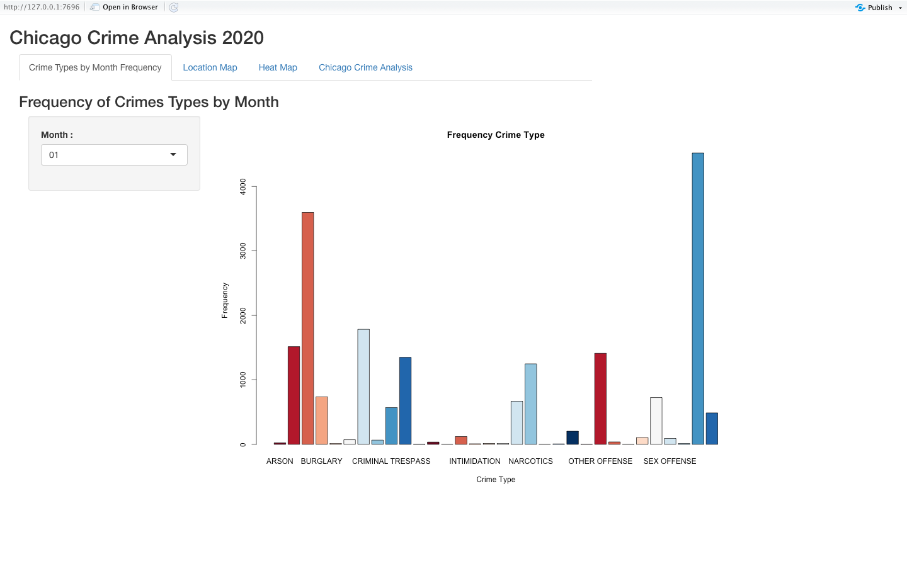
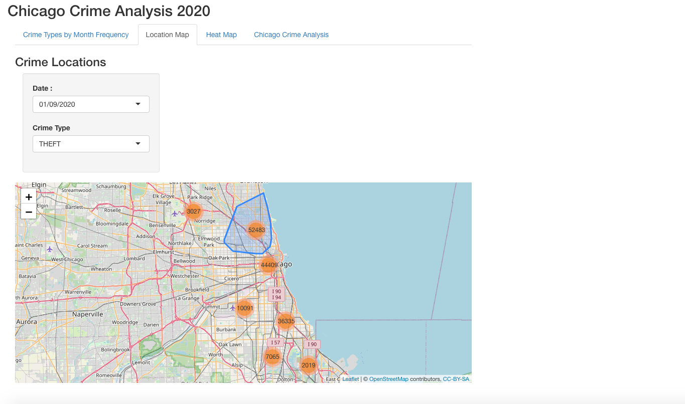
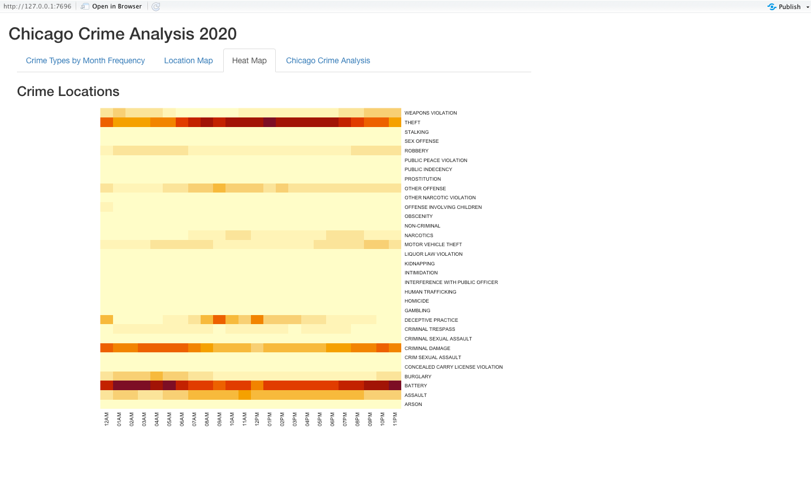

# RShinyApplication2

Shiny is an R package that makes it easy to build interactive web applications (apps) straight from R. You can do quite a lot with Shiny: think of it as an easy way to make an interactive web page, and that web page can seamlessly interact with R and display R objects (plots, tables, of anything else you do in R). Every Shiny app is composed of a two parts:

Web page that shows the app to the user (UI)
Computer that powers the app (Server)
The computer that runs the app can either be your own laptop (such as when you’re running an app from RStudio) or a server somewhere else. UI is just a web document that the user gets to see, it’s HTML that you write using Shiny’s functions. The UI is responsible for creating the layout of the app and telling Shiny exactly where things go. The server is responsible for the logic of the app it’s the set of instructions that tell the web page what to show when the user interacts with the page.

Data
This dataset reflects reported incidents of crime (with the exception of murders where data exists for each victim) that occurred in the City of Chicago from 2001 to present, minus the most recent seven days. Data is extracted from the Chicago Police Department's CLEAR (Citizen Law Enforcement Analysis and Reporting) system. In order to protect the privacy of crime victims, addresses are shown at the block level only and specific locations are not identified. 
Data file contains information from 2020 only.

Basic preprocessing for the data has been done such finding the missing values, imputing missing values, doing sanity checks such as if the houses exists with feature values given.Refer preprocessing.R

Web page that shows the app to the user is present in the ui.R and all the data manipulation and server program is under server.R

For this App, there are 4 tabs

Tab 1: Bar charts illustrating frequency of crime by month and crime type for different month crime type combinations.

Tab 2: Location of crimes by date on a map.

Tab 3: A heatmap using the type of the crime and the hour of the day when the crime was committed, to identify any relationship between crime type and hour at which the crime is committed.

Tab 4:A tab with any other information that is useful in explaining crime in Chicago.

